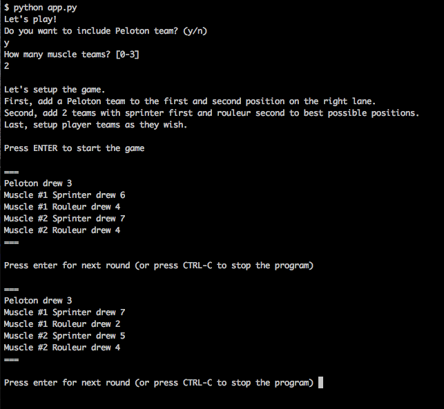

# Flamme Rouge Bot Companion Script

**NOTE**: I also built a web app that you can run on browser. You can find it at [hamatti/flamme-rouge-bot-companion](https://github.com/Hamatti/flamme-rouge-bot-companion)

This is a CLI tool to replace physical decks and drawing for bots when playing [Flamme Rouge](https://boardgamegeek.com/boardgame/199478/flamme-rouge) with bots.



## How to run

You'll need Python 3.6+.

```
python app.py
```

The script will ask you how many bot teams you want and walk you through.
